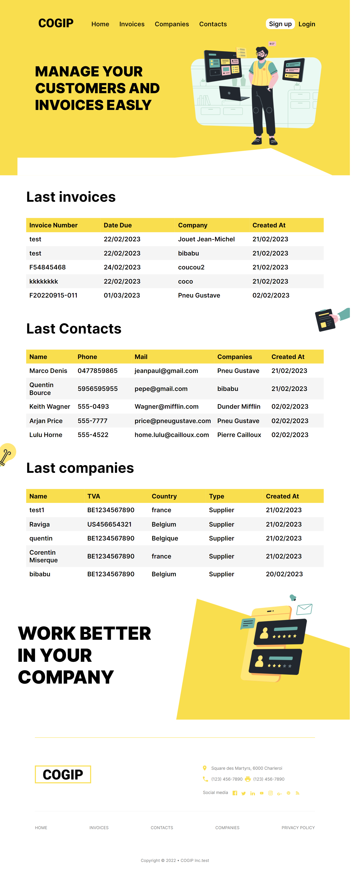

# Cogip Project

A simple website for a fake company done with react/php


## Screenshots


## Link
https://cogip-project-team2.000webhostapp.com/

## Go to [Cogip](https://cogip-project-team2.000webhostapp.com/)
## About
The COGIP is a company which we don't know a lot about apart that they produce Jean-Michel toys and that they are serious workers check. They also have incredible employees within their rank.

Jean-Christian Ranu works in accounting at the COGIP. He has been using an old, ugly and incomplete software for years, making him go between it and excels sheet. Jean-Christian like paella, crosswords and his coworker Muriel Perrache.

Your mission here is to code a web application which will respond to the needs and desire of Jean-Christian.
## Authors
**Backend**
- [@Mariaule Aurélien](https://www.github.com/A-Mariaule)
- [@Bource Quentin](https://github.com/Quentin-Bource)

**Frontend**

- [@Miserque Corentin](https://github.com/Corentinmiserque)
- [@Bajoux Jonathan](https://github.com/JonathanBajoux)


## Tech Stack

**Client:** Vite, React , SASS , HTML 

**Server:** PHP, SQL , Bramus router 


## Features

- Show companies, contacts, invoices lists.
- Dashboard to create, update, delete companies, contacts, invoices.
- Data base (SQL)
- API (CRUD)
- Responsive
## Run Locally

Clone the project

```bash
  git clone https://github.com/A-Mariaule/Cogip_Project.git
```

Go to the project directory

```bash
  cd Cogip_Project/cogip-project
```

Install dependencies

```bash
  npm i
```

Start the server

```bash
  npm run dev
```


## Roadmap

- Login and logout.

- Create a new account.

- Roles & permissions


## Acknowledgements

 - [Becode.org](https://github.com/becodeorg)


